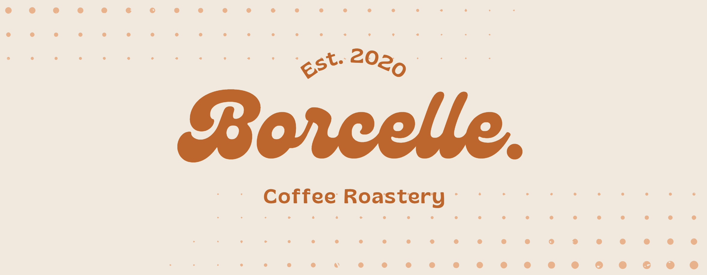

# Documentation for Gabriel's Contribution

> Here's some info about my contributions towards the webpage

## IMPORTANT NOTICE
I was a main contributor towards fonts, assets, and other small contributions on other people's parts, and work outside of the webpage. I never was assigned a major part of the website as the logo wasn't a huge priority once it was done, leaving me to just help everyone else. In short I only helped in small amounts everywhere compared to everyone else who had a role focused on their part. I will only include contributions that had a significant effect.


## OVERVIEW

- I added the logo 
```html
  <div id="logo-container">
    
  </div>
```

- I added a font to replace Gliker
    - since apparently it was a paid font, it threw us off track but I managed to find a similar replacement quickly.
```css
@font-face {
    font-family: Exo-2;
    src: url(https://fonts.googleapis.com/css2?family=Exo+2:ital,wght@0,100..900;1,100..900&display=swap)
}
```

- Styled small amounts in global CSS and edited any issues from other CSS codes
```css
div#Header h3 {
    margin-top: -20px;
    font-family: "Exo 2";
}

#logo-container {
    text-align: center;
    margin: auto;
    margin-top: 25px;
    background-size: contain;
    background-repeat: no-repeat;
    background-position: center;
    height: 20%;
    max-width: 100%;
    z-index: -1;
}
```

- helped with one part of the body section
```html
        <div id="Home-Area" class="body-part">
          <h3>Market Positioning and Audience</h3>
          <p>Borcelle Coffee Roastery targets
            health-conscious individuals,
            coffee enthusiasts, and those
            seeking a nostalgic dining
            experience. They position
            themselves as a unique
            establishment, offering a one-of-
            a-kind blend of health, nostalgia,
            and sustainability.</p>
        </div>
```

- I helped clean any messy code or files by organizing them or editing the code

- I wrote the entire presenation slideshow on google slides for the team
    - consisting of 7 slides and revised the entire thing


## REFLECTION
So there were issues on the first week which led me to have a moderately low amount of contributions, the logo which was assigned to me would not work for the first week until we found what the issue was. By the time I was done the main wireframes was already complete, leaving me to add in small changes and edits.
If I were to have more time I would have contributed more into the side nav and anything else I could have added.
That marks the end of my README, thank you for reading and for your time.